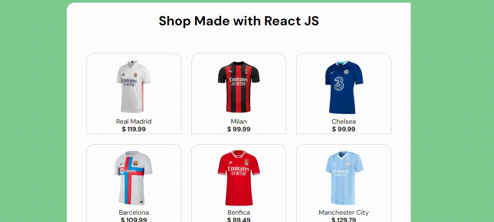

# Loja de camisas em React.js

Para rodar o app é preciso instalar os pacotes
```
npm install
```
Depois para rodar o app digite:
```
npm run dev
```


## Tecnologias utilizadas


<ul>
  <li>HTML5</li>
  <li>CSS3</li>
  <li>Javascript</li>
  <li>React.js</li>
</ul>

## Screenshot 


